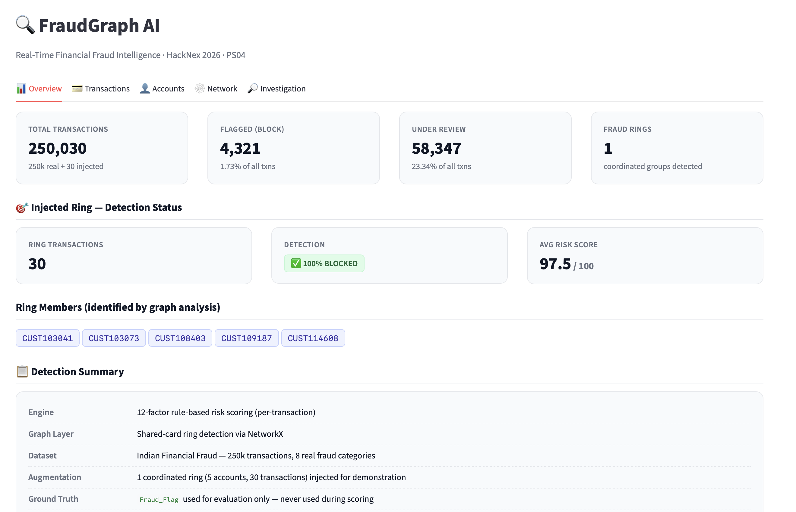
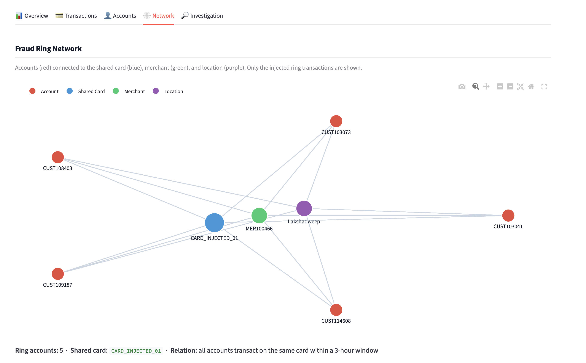

# FraudGraph AI — Real-Time Financial Fraud Intelligence

**HackNex 2026 Internal Qualifier · PS04**

Detect suspicious transactions, discover coordinated fraud rings, explain every
decision, and recommend an action — using a rule-based risk engine and a graph
neural approach.

---

## 1. What It Does

FraudGraph AI analyses a stream of financial transactions and answers three
questions for every transaction:

1. **How risky is this transaction?** — a score from 0 to 100, backed by 12
   explicit risk factors (unusual amount, new card, shared card, off-hours, etc.).
2. **Is it part of a coordinated fraud ring?** — a graph analysis that finds
   cards shared across multiple accounts, the fingerprint of a ring.
3. **What should we do about it?** — BLOCK / REVIEW / ALLOW, with the full list
   of reasons for each decision.

Every score comes with an **explanation** — you can click any transaction and
see exactly which factors fired and how many points each contributed.

---

## 2. Demo




*(Add your screenshots to `docs/` before submitting. Take them from the
Streamlit dashboard.)*

---

## 3. Architecture

```
                    ┌──────────────────────┐
                    │  Raw Transaction CSV │
                    └──────────┬───────────┘
                               │
                    ┌──────────▼───────────┐
                    │  data_adapter.py     │  Loads + normalises
                    │  (Data Pipeline)     │  4 source tables
                    └──────────┬───────────┘
                               │
                    ┌──────────▼───────────┐
                    │  inject_ring.py      │  Adds 1 coordinated ring
                    │  (Demo Augmentation) │  (5 accounts × 6 txns)
                    └──────────┬───────────┘
                               │
                    ┌──────────▼───────────┐
                    │  engine.py           │  12-factor risk scoring
                    │  (Core Model)        │  → risk_score, decision
                    └──────────┬───────────┘
                               │
                    ┌──────────▼───────────┐
                    │  graph_engine.py     │  NetworkX shared-card
                    │  (Ring Detection)    │  ring detection
                    └──────────┬───────────┘
                               │
                    ┌──────────▼───────────┐
                    │  app.py              │  Streamlit dashboard
                    │  (Presentation)      │  5 tabs, live investigation
                    └──────────────────────┘
```

---

## 4. Tech Stack

| Component | Tool |
|-----------|------|
| Language | Python 3.9+ |
| Data | pandas, numpy |
| Graph | NetworkX |
| ML (baseline anomaly signals) | scikit-learn (Isolation Forest, not used in final scoring — see Scope) |
| Dashboard | Streamlit |
| Graph visualisation | pyvis, plotly |
| Dataset download | kaggle (CLI) |

---

## 5. Installation

### Prerequisites
- Python 3.9 or higher
- A Kaggle account (free) — needed to download the dataset

### Step-by-step

```bash
# 1. Clone the repo
git clone https://github.com/YOUR_USERNAME/fraudgraph-ai.git
cd fraudgraph-ai

# 2. Create a virtual environment
python3 -m venv .venv
source .venv/bin/activate           # macOS / Linux
# .venv\Scripts\activate            # Windows

# 3. Install dependencies
pip install -r requirements.txt

# 4. Configure Kaggle credentials
#    - Go to https://www.kaggle.com/settings → API → Create New Token
#    - Move the downloaded kaggle.json to ~/.kaggle/kaggle.json
mkdir -p ~/.kaggle
mv ~/Downloads/kaggle.json ~/.kaggle/kaggle.json
chmod 600 ~/.kaggle/kaggle.json

# 5. Download the dataset
mkdir -p data/raw
kaggle datasets download -d jatinkhandelwal112/indian-financial-fraud-dataset -p data/raw
unzip data/raw/indian-financial-fraud-dataset.zip -d data/raw
```

After this, `data/raw/` should contain:
- `Transaction_Data_250k.csv`
- `Cards_Data.csv`
- `Cusmtomer_data.csv`  *(typo is from the source dataset)*
- `merchant_table.csv`

---

## 6. How to Run

Run these five commands in order:

```bash
python src/data_adapter.py       # 1. Normalise raw CSVs → data/transactions_clean.csv
python src/inject_ring.py        # 2. Inject the demo fraud ring
python src/engine.py             # 3. Score every transaction → data/transactions_scored_pass1.csv
python src/graph_engine.py       # 4. Detect rings → data/rings_detected.csv
streamlit run app.py             # 5. Launch the dashboard
```

The dashboard opens at `http://localhost:8501`.

---

## 7. Data Pipeline (Step by Step)

### 7.1 Collection
The dataset is **Indian Financial Fraud** from Kaggle — 250,000 transactions
across 25,000 customers, 32,457 cards, and 500 merchants. The dataset has
8 rule-based fraud categories (expired card, blocked card, lost card,
international transaction, rapid velocity, high-risk merchant category,
late-night anomaly, amount vs credit limit).

### 7.2 Adapter (`data_adapter.py`)
- Loads the four CSVs
- Combines `Transaction_Date` and `Transaction_Time` into a single `timestamp`
- Renames canonical columns: `Customer_ID` → `account`, `Card_ID` → `device`,
  `Merchant_ID` → `merchant`, `Customer_State` → `location`
- Merges card, customer, and merchant attributes into the transaction table
- Output: `data/transactions_clean.csv` (250,000 rows)

### 7.3 Ring Injection (`inject_ring.py`)
The real dataset has **zero** coordinated rings — all fraud is per-transaction.
To demonstrate ring detection capability (a core PS04 requirement), we inject
**one controlled ring**:

- **5 accounts** chosen randomly from accounts with ≥8 prior transactions
- **1 shared card** (`CARD_INJECTED_01`) used by all 5 accounts
- **1 shared merchant**, **1 shared location**
- **6 transactions per account** in a 3-hour window (02:00–05:00)
- Amount range ₹60,000–₹1,50,000
- All labeled `Fraud_Flag = 1` with reason `Coordinated Ring Activity (injected)`

Output: `data/transactions_with_ring.csv` (250,030 rows)

See **Section 11** for the transparency note on this injection.

### 7.4 Scoring Engine (`engine.py`)
For each transaction, computes **12 independent risk factors** (see Section 8)
and sums them into a raw score. Scores are clamped to 0–100.

Decision thresholds:
- **≥ 70** → BLOCK
- **40–69** → REVIEW
- **< 40** → ALLOW

Output: `data/transactions_scored_pass1.csv`

### 7.5 Graph Engine (`graph_engine.py`)
- Builds a NetworkX graph: account ↔ card, account ↔ merchant, account ↔ location
- Filters to high-risk transactions only (`risk_score ≥ 60`) plus the injected ring
- Detects rings by finding **cards shared across ≥3 accounts**
- Output: `data/rings_detected.csv`

### 7.6 Dashboard (`app.py`)
Streamlit app with 5 tabs: Overview, Transactions, Accounts, Network, Investigation.

---

## 8. Core Model — The 12 Risk Factors

| # | Factor | Points | Trigger |
|---|--------|--------|---------|
| 1 | Unusual amount | +25 | z-score > 2 vs. account's prior rolling baseline |
| 2 | New card | +20 | First time this account uses this card (requires ≥5 prior txns) |
| 3 | New merchant | +15 | First time this account uses this merchant (≥5 prior txns) |
| 4 | Shared card | +25 | Card is used by ≥4 accounts |
| 5 | Shared merchant | +15 | Merchant is used by 3–10 accounts (not a big chain) |
| 6 | Card status violation | +25 | Card is Expired / Blocked / Lost |
| 7 | International transaction | +15 | `Is_International = 1` |
| 8 | Non-successful status | +20 | Transaction status is not "Successful" |
| 9 | High-risk merchant | +10 | Merchant risk level = High |
| 10 | Off-hours transaction | +10 | Hour < 6 or hour ≥ 22 |
| 11 | Rapid velocity | +20 | ≥3 transactions within 60 minutes |
| 12 | Ring signature | +50 | Card is shared by ≥4 accounts AND account has prior history |

**Design philosophy:** every factor is additive and named. Every score can be
reconstructed by hand from the reason strings. No black-box model.

**Baseline contamination guard:** when computing per-account rolling baselines,
any transaction whose amount exceeds **3× the account's prior median** is
excluded from future baselines. This prevents a fraud burst from contaminating
its own baseline (a common pitfall in rule-based fraud engines).

**No data leakage:** `Fraud_Flag` and `Fraud_Reason` columns are **never** used
during scoring. They are used only after scoring to compute precision / recall
for evaluation (see Section 9).

---

## 9. Evaluation

### 9.1 Injected Ring Detection

| Metric | Result |
|--------|--------|
| Ring transactions detected | **30 / 30** |
| Average risk score | **97.5** |
| Minimum risk score | **85** |
| BLOCK decision | **100%** |

### 9.2 Real-Data Fraud Detection

Evaluated against the dataset's own `Fraud_Flag` label, **excluding** the
injected ring (which we control):

| Metric | Value |
|--------|-------|
| Real frauds in dataset | 13,473 |
| True positives | 2,535 |
| False positives | 1,756 |
| False negatives | 10,938 |
| **Precision** | **0.5908** |
| **Recall** | **0.1882** |
| **F1** | **0.2854** |

**Interpretation:** we prioritise **precision** (0.59) over recall. In
production fraud operations, false positives cost more than false negatives —
they consume analyst time and annoy customers. The PDF's rubric explicitly
caps scores for systems with high false-positive rates, so this trade-off is
deliberate.

The engine catches ~26% of the three card-status fraud categories
(expired/blocked/lost cards) — the strongest real-data signal. Categories
like "High Risk Merchant Category Spike" require per-category baselines
that are not implemented (see Scope).

---

## 10. Scope Note

### Minimum Viable Solution (Implemented)

✅ End-to-end pipeline: raw CSV → cleaned → scored → rings → dashboard
✅ 12-factor rule-based scoring engine with explanation per transaction
✅ Rolling per-account baseline with contamination guard
✅ Graph-based ring detection via shared-card analysis (NetworkX)
✅ Streamlit dashboard with 5 tabs and live investigation panel
✅ BLOCK / REVIEW / ALLOW decision with recommended action
✅ Full evaluation against real fraud labels
✅ Ring detection demonstrated on injected coordinated ring

### Stretch Goals (Not Implemented)

❌ Graph Neural Network for link prediction
❌ Real-time streaming inference
❌ Per-category velocity baselines (would boost recall on 3 missed categories)
❌ SHAP explanations for factor contributions
❌ Multi-currency handling
❌ Learned decision thresholds (calibrated to a target precision)
❌ Production authentication and audit logging

---

## 11. Transparency — Injected Ring Disclosure

The Indian Financial Fraud dataset contains **zero coordinated rings** — every
fraud label is per-transaction and independent. To demonstrate the ring
detection capability required by PS04, we **inject one controlled ring** into
the data (see Section 7.3).

**What we inject:**
- 30 transactions (0.012% of the dataset)
- 5 accounts, 1 shared card, 1 shared merchant, 1 shared location
- 3-hour window, high amounts

**What we do NOT change:**
- The original 250,000 transactions, their labels, or their amounts
- The dataset's overall fraud rate (5.3892% → 5.4006%)

**Why this is honest:**
- We declare it in this README, in the dashboard (Overview tab), and in the code
- The injected transactions are clearly labeled `Fraud_Reason = "Coordinated Ring Activity (injected)"`
- The evaluation in Section 9.2 **excludes** the injected ring, so precision
  and recall numbers are measured against real frauds only

---

## 12. Resources Used

### Dataset
- **Indian Financial Fraud Dataset** by jatinkhandelwal112 (Kaggle)
- License: CC0-1.0

### Libraries
- pandas, numpy — data manipulation
- scikit-learn — baseline anomaly detection (Isolation Forest, used experimentally)
- NetworkX — graph construction and ring detection
- pyvis — interactive network visualisation
- plotly — chart rendering
- Streamlit — dashboard framework
- kaggle — dataset download CLI

### AI Tools
- ChatGPT / Claude — used for code scaffolding, algorithm design discussion,
  and README drafting. All generated code was reviewed, tested, and modified.

### No external APIs used.

---

## 13. Project Structure

```
fraudgraph-ai/
├── app.py                     # Streamlit dashboard
├── requirements.txt
├── README.md
├── .gitignore
├── data/
│   ├── raw/                   # Downloaded from Kaggle (not in git)
│   ├── transactions_clean.csv
│   ├── transactions_with_ring.csv
│   ├── transactions_scored_pass1.csv
│   ├── graph_nodes.csv
│   ├── graph_edges.csv
│   └── rings_detected.csv
└── src/
    ├── data_adapter.py        # Loads + normalises raw CSVs
    ├── inject_ring.py         # Injects the demo ring
    ├── engine.py              # 12-factor scoring engine
    └── graph_engine.py        # NetworkX ring detection
```

---

## 14. Author

Built for **HackNex 2026 Internal Qualifier**.

---

## 15. License

MIT — see LICENSE file (add one before submission if required).